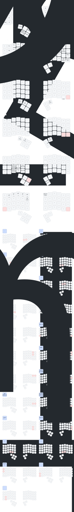

# ch-4-6-wl-nn

4-6 wireless zmk  
KozZzi adopted

Версия прошивки с плавным скролом  
Переделана под МК1 (WHITE), навален мой кеймаппинг

---

## Изменения в бранче `keymap-drawer-integration`

### Добавлена автогенерация SVG-схемы клавиатуры

Теперь при каждом коммите автоматически генерируется визуальная схема раскладки клавиатуры с помощью [keymap-drawer](https://github.com/caksoylar/keymap-drawer).

---

## Добавленные файлы

### 1. `.github/workflows/draw_keymaps.yaml`

**Reusable workflow** для автоматической генерации SVG-схем клавиатуры.

**Что делает:**
- Запускается после каждой сборки прошивки
- Парсит `config/charybdis.keymap`
- Генерирует `charybdis.svg` и `charybdis.yaml` в папке `keymap-drawer/`
- Автоматически коммитит изменения

**Особенности:**
- Использует `amend_commit: true` - перезаписывает последний коммит, а не создает новый
- Поддерживает west modules для ZMK
- Кастомные биндинги мыши и макросов

### 2. `keymap-drawer/config.yaml`

**Конфигурация внешнего вида** генерируемой SVG-схемы.

**Настройки:**
- **Размеры клавиш:** 60x56 px
- **Разрыв между половинами:** 30 px
- **Тема:** auto (автоматическая смена светлой/темной)
- **Комбо-диаграммы:** отдельные, масштаб x2
- **Маппинг ZMK-клавиш:** сокращенные названия

---

## Измененные файлы

### `.github/workflows/main.yml`

**Добавлен джоб `keymap_images`:**

```yaml
keymap_images:
  needs: build
  permissions:
    contents: write
  uses: ./.github/workflows/draw_keymaps.yaml
```

**Что это делает:**
- Запускается только после успешной сборки прошивки
- Вызывает `draw_keymaps.yaml` workflow
- Имеет права на запись для коммитов

### `config/charybdis.keymap`

**Оптимизация слоев:**

Удалены неиспользуемые слои:
- ~~`scroll`~~ (layer 2)
- ~~`symbol`~~ (layer 7)
- ~~`layer_8`~~ (layer 8)
- ~~`layer_9`~~ (layer 9)

**Оставшиеся 6 слоев:**

| # | Имя | Назначение |
|---|------|-------------|
| 0 | `QWERTY` | Базовый слой |
| 1 | `num_and_fun` | Цифры + F-клавиши + навигация |
| 2 | `auto_mouse` | Авто-мышь (клики, скролл) |
| 3 | `snipe_layer` | Точный режим мыши |
| 4 | `corrections` | Коррекции + макросы ("Прошу прощения", "Спасибо") |
| 5 | `set_bt` | Bluetooth настройки + bootloader |

**Перенумерация ссылок:**
- `&mo 3` → `&mo 2` (auto_mouse)
- `&lt 4` → `&lt 3` (snipe_layer)
- `&lt 5` → `&lt 4` (corrections)
- `&mo 6` → `&mo 5` (set_bt)

---

## Результат

После каждого коммита в папке `keymap-drawer/` автоматически обновляются:

- **`charybdis.svg`** - визуальная схема раскладки
- **`charybdis.yaml`** - YAML-описание раскладки

### Просмотр схемы

Схему можно просматривать:
- Напрямую в GitHub: [`keymap-drawer/charybdis.svg`](keymap-drawer/charybdis.svg)
- Вставить в этот README:

```markdown

```

---

## Как работает автогенерация

### Workflow последовательность:

1. **Push/Pull Request** → запуск GitHub Actions
2. **Build ZMK firmware** → сборка прошивки
3. **Draw keymaps** (если build успешен):
   - Установка `keymap-drawer`
   - Инициализация west modules
   - Парсинг `charybdis.keymap` → `charybdis.yaml`
   - Генерация `charybdis.svg`
   - Авто-коммит изменений

### Кастомные биндинги:

Workflow распознает кастомные ZMK-биндинги:
- **Мышь:** `&mkp LCLK`, `&mkp RCLK`, `&mkp MCLK`
- **Скролл:** `&msc SCRL_LEFT`, `&msc SCRL_RIGHT`
- **Макросы:** `&phrase_proshu` ("ПРОШУ ПРОЩЕНИЯ"), `&phrase_spasibo` ("СПАСИБО!")
- **Кастом:** `&mmv_slow` (MOUSE SLOW)

---

## Кредиты

Интеграция основана на [keymap-drawer](https://github.com/caksoylar/keymap-drawer) by [@caksoylar](https://github.com/caksoylar)

---

## Дополнительно

### Отключение amend_commit:

Если не хотите перезаписывать последний коммит, измените в `main.yml`:

```yaml
keymap_images:
  needs: build
  permissions:
    contents: write
  uses: ./.github/workflows/draw_keymaps.yaml
  with:
    amend_commit: false  # Создавать новый коммит
```

### Изменение настроек визуализации:

Редактируйте `keymap-drawer/config.yaml` для тонкой настройки:
- Размеры клавиш
- Цветовые схемы
- Шрифты и размеры текста
- Маппинг клавиш
